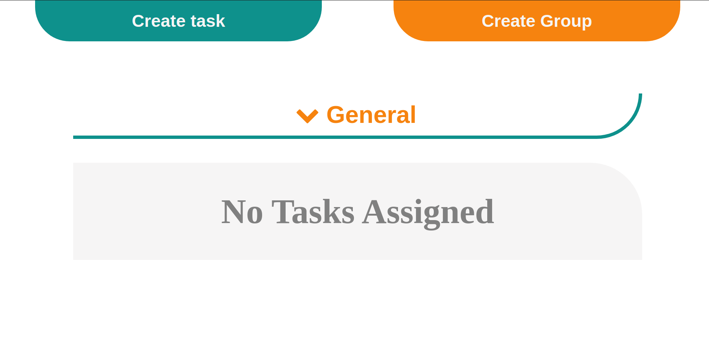

# ToDo List

> This project is to track the tasks that you get into it.

This project is part of the Micorverse Javascript Module. The idea is tu use DOM maipulation and localStorage to create a tracker for tasks and group them together in projects that the user creates.

## Built With

- Javascript
- DOM
- Webpack
- localStorage

## Live Demo

[Live Demo Link](https://raw.githack.com/mateomh/todo-List-JS/todo-list/dist/index.html)

### Usage

Everything you need to run the page is inside the **dist** folder of the project. Just copy the index.html and the main.js from this folder and open the index.html in you browser. Both files should remain in the same folder for it to work.

### Running the tests

First you need to install all the dependencies for the project, to do this run

> npm install

This will get you all the necessary packages to run the tests.

Then just run from the terminal inside the root folder for the project

> npm run test

You are all set, the result should apper in the command line telling you how many tests and suites were made, and how long it took for each set of tests to run.

## Author

👤 **Mateo mojica**

- Github: [@mateomh](https://github.com/mateomh)
- Twitter: [@mateo_m_h](https://twitter.com/mateo_m_h)
- Linkedin: [Mateo mojica](https://linkedin.com/mateo_mojica_hernandez)

## 🤝 Contributing

Contributions, issues and feature requests are welcome!

Feel free to check the [issues page](issues/).

## Show your support

Give a ⭐️ if you like this project!

## Acknowledgments

- Odin Project
- Microverse

## 📝 License

This project is [MIT](https://opensource.org/licenses/MIT) licensed.
